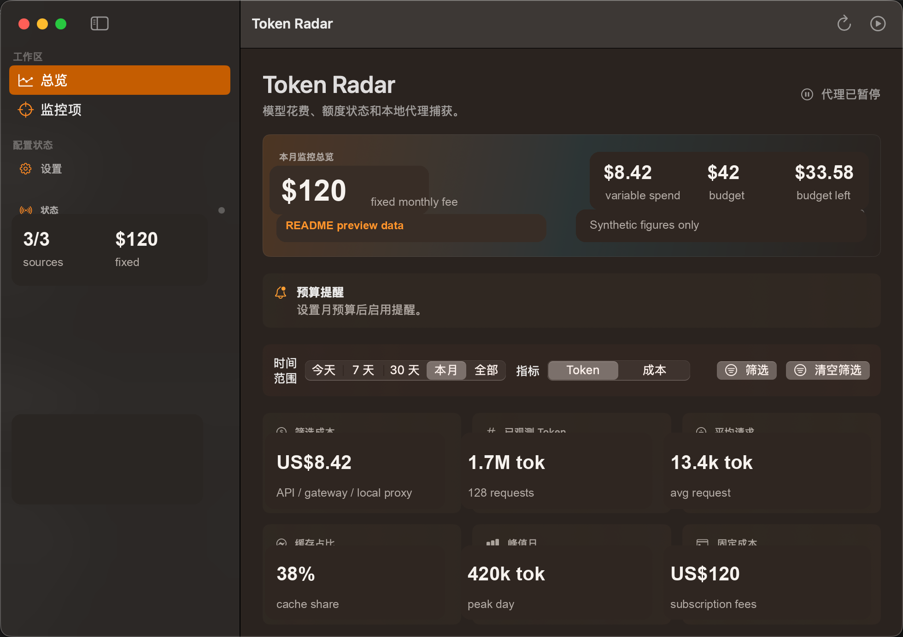

# Token Radar


Token Radar 是一个本地优先的 macOS 菜单栏应用，用来统一查看 AI 模型花费、Token 用量、订阅月费、剩余额度和预算风险。它面向经常同时使用 API、网关、Coding CLI、本地代理和订阅套餐的独立开发者。

> 当前状态：早期预览版。核心监控链路已经可用，但不同供应商的官方接口、消费端订阅额度和浏览器授权支持仍在演进。

## 软件截图



截图中的数字是 README 演示数据，不代表真实账户账单或本机用量。

## 为什么做

现在的 AI 使用成本分散在很多地方：OpenAI/Anthropic API、OpenRouter、Vercel AI Gateway、Cloudflare AI Gateway、本机代理、Codex、Claude Code、ChatGPT/Claude 订阅套餐。供应商控制台有用，但它们通常是碎片化、延迟的，也很难回答几个本地问题：

- 这台 Mac 今天通过哪些入口消耗了 Token？
- 哪个模型烧掉最多输入、输出或缓存 Token？
- API 预算还剩多少，是否可能月底超支？
- 订阅套餐的固定月费和变量 API 花费到底要不要分开算？
- 当前数据是官方账单、本地捕获，还是只能算估算？

Token Radar 把这些来源放到一个本地应用里，并尽量标明每条数据的可信度和边界。

## 当前能力

- 原生 SwiftUI macOS 菜单栏应用，包含总览、监控项、代理、供应商和设置视图。
- 展示预算、变量花费、固定订阅月费、Token 趋势、模型排行、额度 runway 和数据源覆盖范围。
- 本地 SQLite 存储用量记录，macOS Keychain 保存供应商凭据。
- 支持英文、简体中文、繁体中文界面。
- 支持 OpenAI、Anthropic、OpenRouter、Vercel AI Gateway、Cloudflare AI Gateway、DeepSeek 等用量或余额解析。
- 提供 OpenAI 兼容本地代理，支持 `/v1/chat/completions` 和 `/v1/responses`，包括流式与非流式请求。
- 支持 macOS 系统代理、直连、HTTP/HTTPS 代理和 SOCKS 作为上游网络出口。
- 可导入 Claude Code 的本地 JSONL 日志：`~/.claude/projects`。
- 可导入 Codex 的本地 JSONL 会话：`~/.codex/sessions`，包括官方客户端写入的 rate limit 快照。
- 订阅套餐按固定月费、额度窗口、重置日、预测超额和多层 quota window 计算。

更多覆盖范围、刷新行为、授权要求和边界说明见 [Docs/monitoring-source-matrix.md](Docs/monitoring-source-matrix.md)。

## 金额口径

Token Radar 不把所有金额都混成一个数字，而是区分四类：

- 官方花费：供应商或网关 API 返回的成本、余额、credit，用于账单对账。
- 本地估算：Token 数乘以本地模型价格表，用于本地代理和 CLI 日志。
- 月预算：用户设置的 API 预算或告警线，用于预算环、剩余预算和硬限额。
- 固定月费：ChatGPT Plus/Pro、Claude Pro/Max、Codex、Claude Code 等订阅费用，不参与变量用量预算。

## 隐私模型

Token Radar 不需要托管后端。

- API 凭据保存在 macOS Keychain。
- 用量记录保存在本机 SQLite。
- 本地会话导入只读取当前 Mac 上的文件。
- 本地代理只捕获你明确路由到 Token Radar 的客户端请求。
- 官方刷新只调用你配置过的供应商 API。

在接入真实流量或保存供应商凭据前，请先阅读 [PRIVACY.md](PRIVACY.md)。

## 系统要求

- macOS 14 或更新版本
- Xcode Command Line Tools
- Swift 5.10 或更新版本

## 构建和运行

运行核心检查：

```bash
./script/test.sh
```

构建 Swift Package：

```bash
swift build
```

构建并启动本地 app bundle：

```bash
./script/build_and_run.sh
```

构建、启动并确认进程已运行：

```bash
./script/build_and_run.sh --verify
```

## 开发结构

当前 Swift Package 有三个 target：

- `TokenRadar`：SwiftUI macOS 应用。
- `TokenRadarCore`：共享模型、供应商解析、存储、代理核心、计算器和本地会话导入。
- `TokenRadarCoreChecks`：核心行为检查程序。

模块结构和数据流见 [Docs/architecture.md](Docs/architecture.md)。

## 贡献

欢迎提交 issue 和 pull request。请先阅读 [CONTRIBUTING.md](CONTRIBUTING.md)。

重要规则：

- 不要提交真实 API Key、账户 token、私有会话日志、供应商密钥或个人账单数据。
- 供应商集成默认保持只读，除非变更明确是本地捕获或本地设置。
- 如果新增或改变供应商覆盖范围，请同步更新监控来源矩阵。

## 安全

如果你发现安全问题，请按 [SECURITY.md](SECURITY.md) 私下报告。

## 商标说明

Token Radar 是独立项目，不隶属于、不代表、也未获得应用中出现的任何供应商赞助或背书。供应商名称、Logo、产品名和商标归各自权利人所有。详见 [NOTICE](NOTICE) 和 [TRADEMARKS.md](TRADEMARKS.md)。

## 许可证

Token Radar 使用 [MIT License](LICENSE) 开源。
